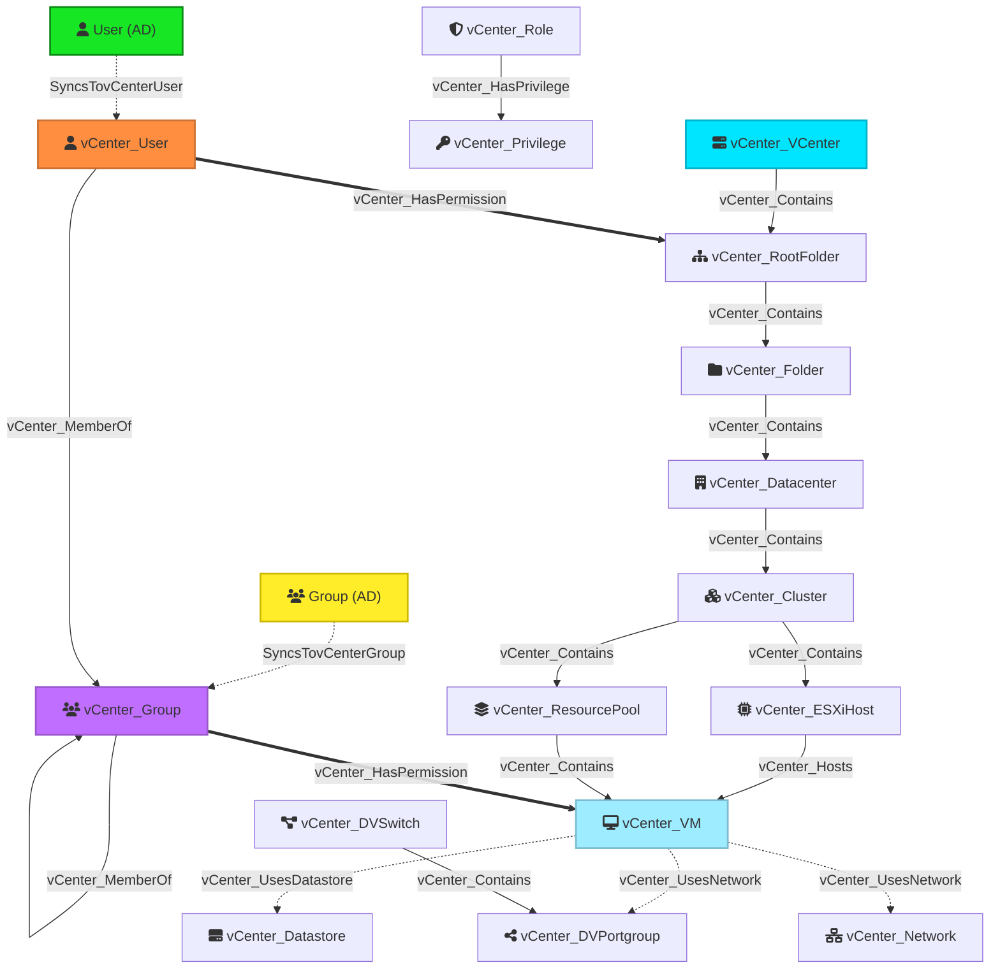

# vCenterHound

Export vCenter data (hosts, VMs, permissions, users, groups, tags) into a BloodHound-compatible JSON file for security analysis and attack path visualization.

🚀 **Now in Go!** This version replaces the original Python script, offering significant performance improvements and new features like REST API tag collection and BloodHound Enterprise integration.

## Features

*   **High Performance**: Go implementation with concurrent processing for large environments.
*   **Comprehensive Collection**:
    *   **Infrastructure**: Datacenters, Clusters, ESXi Hosts, Resource Pools, VMs, Datastores, Networks.
    *   **Permissions**: Roles, Privileges, Users, Groups, and complex permission assignments.
    *   **Tags**: vCenter Tags collected via REST API (associated with VMs/Hosts).
*   **Active Directory Sync**: Automatically links vCenter users/groups to Active Directory nodes in BloodHound by resolving NetBIOS domains to FQDNs via BloodHound Enterprise API.
*   **Group Memberships**: Resolves nested group memberships including SSO and local groups.
*   **BloodHound Compatible**: Generates a standard graph JSON file with custom nodes/edges defined in `model.json`.

## Installation

### Requirements
*   Go 1.21 or later

### Build from Source

```bash
git clone https://github.com/jazofra/vCenterHoundGo
cd vCenterHoundGo
go build -o vCenterHound.exe cmd/vcenterhoundgo/main.go
```

## Usage

### 1. Upload Model to BloodHound
Before importing data, you must register the custom node/edge types in BloodHound. Use the provided `model.json`.

(Use `update_custom_nodes_to_bloodhound.py` if available, or upload via BloodHound API).

### 2. Run Collector

**Basic Run:**
```bash
./vCenterHound -s vc.example.com -u administrator@vsphere.local -p "Password!"
```

**With Active Directory Sync (BloodHound Enterprise):**
This mode fetches available domains from BloodHound to map vCenter NetBIOS names (e.g., `CORP`) to FQDNs (e.g., `CORP.LOCAL`), creating `SyncsTovCenterUser` edges.

```bash
./vCenterHound \
  -s vc.example.com \
  -u administrator@vsphere.local \
  -p "Password!" \
  --bh-url https://bloodhound.example.com \
  --bh-key-id "YOUR_KEY_ID" \
  --bh-key-secret "YOUR_KEY_SECRET"
```

**Debug Mode:**
Enable detailed logging and stats.
```bash
./vCenterHound -s vc.example.com ... --debug
```

### Command-Line Arguments

*   `-s`: vCenter server(s) (comma-separated).
*   `-u`: vCenter username.
*   `-p`: vCenter password.
*   `-P`: vCenter port (default 443).
*   `-o`: Output file path (default `vcenter_graph.json`).
*   `--debug`: Enable debug logging.
*   `--bh-url`: BloodHound Enterprise URL (for AD sync).
*   `--bh-key-id`: BloodHound API Key ID.
*   `--bh-key-secret`: BloodHound API Key Secret.

## Node Types

The tool generates the following node types:

| Node Type | Description |
|-----------|-------------|
| `vCenter_VCenter` | The top-level vCenter server object. |
| `vCenter_RootFolder` | The root folder of the inventory. |
| `vCenter_Datacenter` | A logical container for all inventory objects. |
| `vCenter_Folder` | A folder used to group entities. |
| `vCenter_Cluster` | A cluster of ESXi hosts. |
| `vCenter_ESXiHost` | A physical server running ESXi. |
| `vCenter_ResourcePool` | A partition of compute resources. |
| `vCenter_VM` | A Virtual Machine. |
| `vCenter_Datastore` | A storage container. |
| `vCenter_Network` | A standard network. |
| `vCenter_DVSwitch` | A Distributed Virtual Switch. |
| `vCenter_DVPortgroup` | A Distributed Virtual Portgroup. |
| `vCenter_User` | A vCenter user (local or SSO). |
| `vCenter_Group` | A vCenter user group. |
| `vCenter_Role` | A collection of privileges. |
| `vCenter_Privilege` | A specific granular permission. |

## Edge Types

| Edge Type | Source | Target | Description |
|-----------|--------|--------|-------------|
| `vCenter_Contains` | Container | Entity | Hierarchical containment (e.g., Folder->DC, DC->Cluster). |
| `vCenter_Hosts` | vCenter_ESXiHost | vCenter_VM | Indicates which host is running the VM. |
| `vCenter_UsesDatastore` | vCenter_VM | vCenter_Datastore | VM storage dependency. |
| `vCenter_UsesNetwork` | vCenter_VM | vCenter_Network / DVPortgroup | VM network connection. |
| `vCenter_HasPermission` | vCenter_User / Group | Entity | Direct permission assignment on an object. |
| `vCenter_HasPrivilege` | vCenter_Role | vCenter_Privilege | Links a Role to its defined privileges. |
| `vCenter_MemberOf` | vCenter_User / Group | vCenter_Group | Group membership within vCenter. |
| `SyncsTovCenterUser` | User (AD) | vCenter_User | Links an AD User to its corresponding vCenter Principal. |
| `SyncsTovCenterGroup` | Group (AD)| vCenter_Group| Links an AD Group to its corresponding vCenter Principal. |

## Data Flow Diagram

Relationship visualization between vCenter entities and inferred external AD objects:



## Useful Cypher Queries

### 1. Find Users with Direct Access to VMs
Identify users who have been granted direct permissions on Virtual Machines.

```cypher
MATCH (u:vCenter_User)-[r:vCenter_HasPermission]->(vm:vCenter_VM)
RETURN u.name, r.roleName, vm.name
```

### 2. Find AD Users with Path to vCenter
Find Active Directory users who can control vCenter entities via synchronization.

```cypher
MATCH (ad:User)-[:SyncsTovCenterUser]->(vc:vCenter_User)-[:vCenter_HasPermission]->(n)
RETURN ad.name, vc.name, labels(n)[0] as EntityType, n.name
```

### 3. Find Users with Admin-like Access (Root Folder)
Users with permissions on the Root Folder likely have access to the entire vCenter environment.

```cypher
MATCH (u)-[r:vCenter_HasPermission]->(f:vCenter_RootFolder)
RETURN u.name, r.roleName, f.name
```

### 4. Find VMs Accessible by a Specific Group
List all VMs that a specific group (e.g., "Developers") can access.

```cypher
MATCH (g:vCenter_Group {name: "Developers"})-[:vCenter_HasPermission]->(n)
OPTIONAL MATCH (n)-[:vCenter_Contains*]->(vm:vCenter_VM)
RETURN vm.name, n.name as PermissionScope
```

### 5. Find All Non-AD Users (Local vCenter Users)
Identify users that are local to vCenter and not synced from Active Directory.

```cypher
MATCH (u:vCenter_User)
WHERE NOT (u)<-[:SyncsTovCenterUser]-(:User)
RETURN u.name
```

### 6. Map VMs to their ESXi Hosts
Simple infrastructure mapping.

```cypher
MATCH (h:vCenter_ESXiHost)-[:vCenter_Hosts]->(vm:vCenter_VM)
RETURN h.name, count(vm) as VMCount, collect(vm.name) as VMs
```

## Acknowledgments

This tool is a Go port and enhancement of the original [vCenterHound](https://github.com/MorDavid/vCenterHound) by **Mor David**.

Original Author: Mor David (https://github.com/MorDavid)
Go Port & Enhancements: Javier Azofra Ovejero
